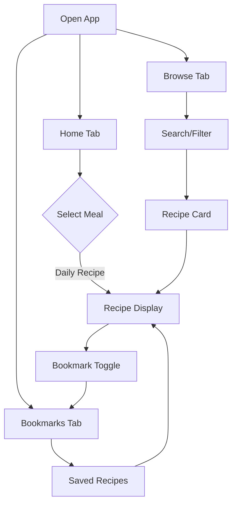

# Vegan Daily 🌱

A React Native Expo Go app that suggests easy vegan meals for breakfast, lunch, and dinner every day.

---

## Table of Contents

1. [Overview](#overview)
2. [Features](#features)
3. [Architecture](#architecture)
4. [Project Structure](#project-structure)
5. [Data Management](#data-management)
6. [Code Standards](#code-standards)
7. [Getting Started](#getting-started)
8. [Adding New Recipes](#adding-new-recipes)
9. [Adding New Ingredients](#adding-new-ingredients)
10. [Development Guidelines](#development-guidelines)
11. [Roadmap](#roadmap)
12. [Changelog](#changelog)

---

## Overview

Vegan Daily is a simple, no-account-required mobile app that helps users discover delicious vegan meals. Instead of overwhelming users with endless options, the app presents **one breakfast, one lunch, and one dinner suggestion each day**.

### Philosophy

- **Simple**: No browsing, no accounts, just tap and cook
- **Daily Discovery**: Fresh meal suggestions every day
- **Easy to Maintain**: Add recipes by simply adding files to the repository
- **Modular**: Strict code splitting for maintainability

---

## Features

### Core Features

| Feature | Description |
|---------|-------------|
| **Daily Meal Suggestions** | One breakfast, lunch, and dinner recipe per day |
| **Browse & Discover** | Search and filter through the entire recipe library |
| **Bookmarks** | Save your favorite recipes locally on your device |
| **Adjustable Servings** | Scale ingredient amounts with +/- buttons |
| **No Account Required** | Privacy-first, no sign-up needed |
| **Offline-Ready** | All recipes bundled in the app |

### User Flow



---

## Architecture

### Technology Stack

| Layer | Technology |
|-------|------------|
| **Framework** | React Native with Expo Go |
| **Language** | TypeScript |
| **Navigation** | Expo Router |
| **State** | React Context (minimal) |
| **Startup** | expo-splash-screen |
| **Styling** | StyleSheet API |

### Design Principles

1. **Code Splitting**: All files must be ≤300 lines of code
2. **Single Responsibility**: Each component does one thing well
3. **Type Safety**: Full TypeScript coverage
4. **Documentation-First**: Update docs with any fundamental changes

---

## Project Structure

```
vegandaily/
├── .gitignore
├── AGENTS.md
├── CHANGELOG.md
├── README.md
├── app
│   ├── (tabs)
│   │   ├── _layout.tsx
│   │   ├── bookmarks.tsx
│   │   ├── browse.tsx
│   │   └── home.tsx
│   ├── recipe
│   │   ├── [mealType].tsx
│   │   └── detail
│   │       └── [id].tsx
│   ├── _layout.tsx
│   ├── index.tsx (Mobile redirect)
│   ├── index.web.tsx (Web landing page)
│   ├── privacy.tsx
│   └── terms.tsx
├── app.json
├── assets
│   ├── adaptive-icon.png
│   ├── favicon.png
│   ├── icon.png
│   ├── recipes
│   │   ├── bread
│   │   │   ├── naan.webp
│   │   │   └── spelt-tortillas.webp
│   │   ├── breakfast
│   │   │   ├── apple-cinnamon-quinoa-breakfast-bowl.webp
│   │   │   ├── banana-walnut-baked-oatmeal-meal-prep.webp
│   │   │   ├── berry-chia-pudding.webp
│   │   │   ├── blueberry-buckwheat-pancakes.webp
│   │   │   ├── breakfast-burrito-beans-potatoes-salsa.webp
│   │   │   ├── chickpea-flour-omelet-veggies.webp
│   │   │   ├── chickpea-scramble-peppers.webp
│   │   │   ├── chickpeas-toast.webp
│   │   │   ├── cinnamon-apple-overnight-oats.webp
│   │   │   ├── date-nut-breakfast-bars-no-bake.webp
│   │   │   ├── high-fiber-smoothie-bowl-berry-flax.webp
│   │   │   ├── oatmeal-carrot-cake-bowl.webp
│   │   │   ├── omelette.webp
│   │   │   ├── overnight-oats.webp
│   │   │   ├── peanut-butter-banana-smoothie.webp
│   │   │   ├── pear-almond-butter-toast-hemp.webp
│   │   │   ├── pumpkin-pie-overnight-oats.webp
│   │   │   ├── savory-avocado-toast-tomato-hemp.webp
│   │   │   ├── savory-breakfast-lentils-garlic-greens.webp
│   │   │   ├── savory-oatmeal-mushrooms-spinach.webp
│   │   │   ├── sweet-potato-breakfast-hash-beans-greens.webp
│   │   │   ├── warm-millet-porridge-berries.webp
│   │   │   └── warm-quinoa-breakfast-bowl-coconut-mango.webp
│   │   ├── dessert
│   │   │   ├── baked-cinnamon-pears-walnuts.webp
│   │   │   ├── banana-nice-cream-1-ingredient-base.webp
│   │   │   ├── black-bean-brownies.webp
│   │   │   ├── blondies.webp
│   │   │   ├── carrot-cake-bliss-balls.webp
│   │   │   ├── chocolate-avocado-mousse.webp
│   │   │   ├── cinnamon-rolls.webp
│   │   │   ├── coconut-rice-pudding-simple.webp
│   │   │   ├── dark-chocolate-covered-almonds-quick.webp
│   │   │   ├── lemon-blueberry-chia-jam.webp
│   │   │   ├── matcha-cookies.webp
│   │   │   ├── oatmeal-creme-pies.webp
│   │   │   ├── peanut-butter-chocolate-bark-freezer.webp
│   │   │   ├── strawberry-oat-shortcake-bowl.webp
│   │   │   └── warm-apple-crumble-oat-topping.webp
│   │   ├── dinner
│   │   │   ├── black-bean-sweet-potato-chili.webp
│   │   │   ├── butternut-squash-risotto.webp
│   │   │   ├── cabbage-rolls.webp
│   │   │   ├── cashew-tomato-soup-veggie-sandwich.webp
│   │   │   ├── chickpea-shawarma-bowl.webp
│   │   │   ├── coconut-chickpea-curry-spinach.webp
│   │   │   ├── creamy-cashew-tomato-soup-grilled-veggie-sandwich.webp
│   │   │   ├── creamy-coconut-red-lentil-curry.webp
│   │   │   ├── creamy-potato-corn-chowder-no-dairy.webp
│   │   │   ├── creamy-white-bean-tomato-orzo.webp
│   │   │   ├── eggplant-chickpea-tagine.webp
│   │   │   ├── garlic-lemon-broccoli-chickpea-pasta.webp
│   │   │   ├── hearty-lentil-bolognese.webp
│   │   │   ├── jamaican-style-cabbage-beans-over-rice.webp
│   │   │   ├── lemon-garlic-pasta-cannellini-asparagus.webp
│   │   │   ├── lentil-shepherds-pie.webp
│   │   │   ├── moroccan-lentil-stew-carrot-apricot.webp
│   │   │   ├── mushroom-steak-garlic-herb-potatoes.webp
│   │   │   ├── one-pan-pesto-veggie-pasta.webp
│   │   │   ├── one-pot-spanish-beans-greens.webp
│   │   │   ├── pasta-primavera.webp
│   │   │   ├── red-beans-rice-weeknight-version.webp
│   │   │   ├── roasted-cauliflower-tacos-lime-slaw.webp
│   │   │   ├── roasted-veggie-lentil-sausage-free-bake.webp
│   │   │   ├── sheet-pan-gnocchi-veg-no-meat-no-dairy.webp
│   │   │   ├── stuffed-bell-peppers-quinoa-beans.webp
│   │   │   ├── stuffed-eggplant-lentils-herbs.webp
│   │   │   ├── stuffed-sweet-potatoes.webp
│   │   │   ├── thai-peanut-chickpea-curry.webp
│   │   │   ├── vegetable-paella.webp
│   │   │   ├── veggie-fried-rice-chickpeas.webp
│   │   │   └── zucchini-boats-with-lentil-marinara.webp
│   │   ├── lunch
│   │   │   ├── baked-falafel-salad-bowl.webp
│   │   │   ├── barley-chickpea-greek-bowl.webp
│   │   │   ├── black-bean-corn-salad-meal-prep.webp
│   │   │   ├── brothy-miso-mushroom-noodle-soup.webp
│   │   │   ├── creamy-avocado-pea-pasta-green-sauce.webp
│   │   │   ├── creamy-roasted-red-pepper-pasta-salad.webp
│   │   │   ├── creamy-white-bean-broccoli-baked-potato-bowl.webp
│   │   │   ├── curried-chickpea-tuna-sandwich.webp
│   │   │   ├── ginger-carrot-red-lentil-soup.webp
│   │   │   ├── lemon-dill-white-bean-cucumber-salad.webp
│   │   │   ├── lentil-veggie-soup-one-pot.webp
│   │   │   ├── mediterranean-chickpea-salad-wraps.webp
│   │   │   ├── mediterranean-wrap.webp
│   │   │   ├── minestrone-beans-veg-pasta.webp
│   │   │   ├── quinoa-tabbouleh-chickpeas.webp
│   │   │   ├── rainbow-quinoa-bowl-lemon-tahini.webp
│   │   │   ├── red-beans-rice.webp
│   │   │   ├── red-beans.webp
│   │   │   ├── roasted-beet-orange-walnut-salad.webp
│   │   │   ├── roasted-carrot-lentil-wraps-tahini.webp
│   │   │   ├── roasted-cauliflower-tahini-rice-bowl.webp
│   │   │   ├── roasted-veg-lentil-salad-lemon-mustard.webp
│   │   │   ├── roasted-veggie-hummus-pita.webp
│   │   │   ├── sesame-ginger-cabbage-noodle-soup.webp
│   │   │   ├── smashed-chickpea-pita-pickles-greens.webp
│   │   │   ├── smoky-black-bean-quesadilla-no-cheese.webp
│   │   │   ├── smoky-corn-black-bean-rice-salad.webp
│   │   │   ├── spicy-peanut-soba-noodle-bowl.webp
│   │   │   ├── split-pea-soup-thick-cozy.webp
│   │   │   ├── sweet-potato-white-bean-kale-salad.webp
│   │   │   ├── tomato-basil-white-bean-toasts.webp
│   │   │   ├── tomato-white-bean-pizza-toasts.webp
│   │   │   ├── warm-farro-bowl-mushrooms-spinach.webp
│   │   │   └── white-bean-mash.webp
│   │   └── snack
│   │       ├── apple-nachos-pb-seeds.webp
│   │       ├── classic-hummus-creamy.webp
│   │       ├── date-tahini-energy-bites.webp
│   │       ├── guacamole-veggie-sticks.webp
│   │       ├── kimchi.webp
│   │       ├── lemon-garlic-green-peas-warm.webp
│   │       ├── quick-pickled-cucumbers.webp
│   │       ├── roasted-chickpeas-crunchy.webp
│   │       ├── smoky-salsa-style-black-bean-dip.webp
│   │       ├── spiced-nuts-pan-toasted.webp
│   │       └── warm-cinnamon-walnuts.webp
│   └── splash-icon.png
├── docs
│   └── possible-features.md
├── package-lock.json
├── package.json
├── src
│   ├── components
│   │   ├── BookmarkButton.tsx
│   │   ├── EmptyState.tsx
│   │   ├── FilterChips.tsx
│   │   ├── Header.tsx
│   │   ├── MealButton.tsx
│   │   ├── RecipeCard.tsx
│   │   ├── RecipeDisplay.tsx
│   │   ├── SearchBar.tsx
│   │   └── ServingsAdjuster.tsx
│   ├── context
│   │   ├── BookmarkContext.tsx
│   │   └── DailyRecipeContext.tsx
│   ├── data
│   │   └── recipes
│   │       ├── bread
│   │       │   ├── garlic-naan.ts
│   │       │   ├── index.ts
│   │       │   └── spelt-tortillas.ts
│   │       ├── breakfast
│   │       │   ├── apple-cinnamon-quinoa-breakfast-bowl.ts
│   │       │   ├── banana-walnut-baked-oatmeal-meal-prep.ts
│   │       │   ├── berry-chia-pudding.ts
│   │       │   ├── blueberry-buckwheat-pancakes.ts
│   │       │   ├── breakfast-burrito-beans-potatoes-salsa.ts
│   │       │   ├── chickpea-flour-omelet-no-egg-veggies.ts
│   │       │   ├── chickpea-omelette.ts
│   │       │   ├── chickpea-scramble-no-tofu-peppers.ts
│   │       │   ├── cinnamon-apple-overnight-oats.ts
│   │       │   ├── curried-chickpeas.ts
│   │       │   ├── date-nut-breakfast-bars-no-bake.ts
│   │       │   ├── high-fiber-smoothie-bowl-berry-flax.ts
│   │       │   ├── index.ts
│   │       │   ├── oatmeal-carrot-cake-bowl.ts
│   │       │   ├── overnight-oats.ts
│   │       │   ├── peanut-butter-banana-smoothie.ts
│   │       │   ├── pear-almond-butter-toast-with-hemp.ts
│   │       │   ├── pumpkin-pie-overnight-oats.ts
│   │       │   ├── savory-avocado-toast-tomato-hemp.ts
│   │       │   ├── savory-breakfast-lentils-garlic-greens.ts
│   │       │   ├── savory-oatmeal-with-mushrooms-spinach.ts
│   │       │   ├── sweet-potato-breakfast-hash-beans-greens.ts
│   │       │   ├── warm-millet-porridge-berries.ts
│   │       │   └── warm-quinoa-breakfast-bowl-coconut-mango.ts
│   │       ├── dessert
│   │       │   ├── baked-cinnamon-pears-walnuts.ts
│   │       │   ├── banana-nice-cream-1-ingredient-base.ts
│   │       │   ├── black-bean-brownie.ts
│   │       │   ├── carrot-cake-bliss-balls.ts
│   │       │   ├── chocolate-avocado-mousse.ts
│   │       │   ├── chocolate-chip-blondies.ts
│   │       │   ├── cinnamon-rolls.ts
│   │       │   ├── coconut-rice-pudding-simple.ts
│   │       │   ├── dark-chocolate-covered-almonds-quick.ts
│   │       │   ├── index.ts
│   │       │   ├── lemon-blueberry-chia-jam.ts
│   │       │   ├── matcha-cookies.ts
│   │       │   ├── oatmeal-creme-pies.ts
│   │       │   ├── peanut-butter-chocolate-bark-freezer.ts
│   │       │   ├── strawberry-oat-shortcake-bowl.ts
│   │       │   └── warm-apple-crumble-oat-topping.ts
│   │       ├── dinner
│   │       │   ├── black-bean-sweet-potato-chili.ts
│   │       │   ├── butternut-squash-risotto-creamy-no-dairy.ts
│   │       │   ├── cabbage-rolls-rice-lentils.ts
│   │       │   ├── chickpea-shawarma-bowls.ts
│   │       │   ├── coconut-chickpea-curry-spinach.ts
│   │       │   ├── creamy-cashew-tomato-soup-grilled-veggie-sandwich.ts
│   │       │   ├── creamy-coconut-red-lentil-curry.ts
│   │       │   ├── creamy-potato-corn-chowder-no-dairy.ts
│   │       │   ├── creamy-tomato-basil-orzo-white-beans.ts
│   │       │   ├── eggplant-chickpea-tagine-warm-spices.ts
│   │       │   ├── garlic-lemon-broccoli-chickpea-pasta.ts
│   │       │   ├── hearty-lentil-bolognese.ts
│   │       │   ├── index.ts
│   │       │   ├── jamaican-style-cabbage-beans-over-rice.ts
│   │       │   ├── lemon-garlic-pasta-with-cannellini-asparagus.ts
│   │       │   ├── lentil-shepherd-s-pie-no-meat.ts
│   │       │   ├── moroccan-lentil-stew-carrot-apricot.ts
│   │       │   ├── mushroom-steak-garlic-herb-potatoes.ts
│   │       │   ├── one-pan-pesto-veggie-pasta-nut-based-pesto.ts
│   │       │   ├── one-pot-spanish-beans-greens.ts
│   │       │   ├── pasta-primavera.ts
│   │       │   ├── red-beans-rice-weeknight-version.ts
│   │       │   ├── roasted-cauliflower-tacos-lime-slaw.ts
│   │       │   ├── roasted-veggie-lentil-sausage-free-bake.ts
│   │       │   ├── sheet-pan-gnocchi-veg-no-meat-no-dairy.ts
│   │       │   ├── stuffed-bell-peppers-quinoa-beans.ts
│   │       │   ├── stuffed-eggplant-lentils-herbs.ts
│   │       │   ├── stuffed-sweet-potatoes-black-beans-corn-avocado.ts
│   │       │   ├── thai-style-peanut-curry-chickpeas-veg.ts
│   │       │   ├── vegetable-paella-chickpeas-peas.ts
│   │       │   ├── veggie-fried-rice-chickpeas-instead-of-egg-meat.ts
│   │       │   └── zucchini-boats-with-lentil-marinara.ts
│   │       ├── index.ts
│   │       ├── lunch
│   │       │   ├── baked-falafel-salad-bowl-homemade-not-meat.ts
│   │       │   ├── barley-chickpea-greek-bowl.ts
│   │       │   ├── black-bean-corn-salad-meal-prep.ts
│   │       │   ├── brothy-miso-mushroom-noodle-soup-no-tofu.ts
│   │       │   ├── creamy-avocado-pea-pasta-green-sauce.ts
│   │       │   ├── creamy-roasted-red-pepper-pasta-salad-no-dairy.ts
│   │       │   ├── creamy-white-bean-broccoli-baked-potato-bowl.ts
│   │       │   ├── curried-chickpea-tuna-sandwich-no-mayo-needed.ts
│   │       │   ├── ginger-carrot-red-lentil-soup.ts
│   │       │   ├── index.ts
│   │       │   ├── lemon-dill-white-bean-cucumber-salad.ts
│   │       │   ├── lentil-veggie-soup-one-pot.ts
│   │       │   ├── mediterranean-chickpea-salad-wraps.ts
│   │       │   ├── mediterranean-wrap.ts
│   │       │   ├── minestrone-beans-veg-pasta.ts
│   │       │   ├── quinoa-tabbouleh-chickpeas.ts
│   │       │   ├── rainbow-quinoa-bowl-lemon-tahini.ts
│   │       │   ├── red-beans-rice.ts
│   │       │   ├── roasted-beet-orange-walnut-salad.ts
│   │       │   ├── roasted-carrot-lentil-wraps-with-tahini.ts
│   │       │   ├── roasted-cauliflower-tahini-rice-bowl.ts
│   │       │   ├── roasted-veg-lentil-salad-lemon-mustard.ts
│   │       │   ├── roasted-veggie-hummus-pita.ts
│   │       │   ├── sesame-ginger-cabbage-noodle-soup-quick.ts
│   │       │   ├── smashed-chickpea-pita-with-pickles-greens.ts
│   │       │   ├── smoky-black-bean-quesadilla-no-cheese.ts
│   │       │   ├── smoky-corn-black-bean-rice-salad.ts
│   │       │   ├── spicy-peanut-soba-noodle-bowl-no-tofu.ts
│   │       │   ├── split-pea-soup-thick-cozy.ts
│   │       │   ├── sweet-potato-white-bean-kale-salad.ts
│   │       │   ├── tomato-basil-white-bean-toasts.ts
│   │       │   ├── tomato-white-bean-pizza-toasts.ts
│   │       │   ├── warm-farro-bowl-with-mushrooms-spinach.ts
│   │       │   └── white-bean-mash.ts
│   │       └── snack
│   │           ├── apple-nachos-pb-seeds.ts
│   │           ├── classic-hummus-creamy.ts
│   │           ├── date-tahini-energy-bites.ts
│   │           ├── edamame-alternative-snack-lemon-garlic-green-peas-warm.ts
│   │           ├── guacamole-veggie-sticks.ts
│   │           ├── index.ts
│   │           ├── kimchi.ts
│   │           ├── quick-pickled-cucumbers.ts
│   │           ├── roasted-chickpeas-crunchy.ts
│   │           ├── smoky-salsa-style-black-bean-dip.ts
│   │           ├── spiced-nuts-pan-toasted.ts
│   │           └── warm-cinnamon-walnuts.ts
│   ├── theme
│   │   └── index.ts
│   ├── types
│   │   └── index.ts
│   └── utils
│       ├── bookmarkStorage.ts
│       ├── dateUtils.ts
│       ├── formatAmount.ts
│       └── recipeSelector.ts
└── tsconfig.json
```

---

## Data Management

### Recipe Structure

Each recipe is stored as a TypeScript file exporting a `Recipe` object:

```typescript
// src/data/recipes/breakfast/overnight-oats.ts
import { Recipe } from '../../../types';

export const overnightOats: Recipe = {
  id: 'overnight-oats',
  name: 'Overnight Oats',
  mealType: 'breakfast',
  prepTime: 5,        // minutes
  cookTime: 0,        // minutes (overnight setting)
  servings: 1,
  difficulty: 'easy',
  ingredients: [
    { name: 'rolled oats', amount: 0.5, unit: 'cup' }, // Displays as "1/2 cup"
    { name: 'plant milk', amount: 0.5, unit: 'cup' },
    // ... more ingredients
  ],
  instructions: [
    'Combine oats and plant milk in a jar',
    'Add chia seeds and maple syrup',
    // ... more steps
  ],
  tags: ['quick', 'no-cook', 'meal-prep'],
  nutritionPerServing: {
    calories: 350,
    protein: 10,
    carbs: 55,
    fat: 8
  }
};
```

### Ingredient Structure

```typescript
// src/types/index.ts
export interface Ingredient {
  name: string;
  amount: number;
  unit: string;
  optional?: boolean;
}
```

### Daily Selection Algorithm

The app uses a deterministic algorithm based on the current date to select recipes:

```typescript
// Pseudo-code for daily selection
const dayOfYear = getDayOfYear(new Date());
const recipeIndex = dayOfYear % totalRecipes;
```

This ensures:
- Same recipe shown all day for consistency
- Different recipe each day for variety
- Predictable selection for testing

### Formatting

Ingredient amounts are stored as decimals (e.g., `0.5`, `0.25`) for ease of calculation, but are automatically converted to fractions (e.g., `1/2`, `1/4`) when displayed to the user for a better reading experience.

---

## Code Standards

### 300 Line Limit

> [!IMPORTANT]
> **All files must be 300 lines or fewer.** This is a strict requirement.

If a file approaches this limit:
1. Extract reusable logic into utilities
2. Split components into smaller sub-components
3. Move types to dedicated type files
4. Create separate data files

### File Naming

| Type | Convention | Example |
|------|------------|---------|
| Components | PascalCase | `MealButton.tsx` |
| Utilities | camelCase | `recipeSelector.ts` |
| Types | PascalCase | `Recipe.ts` |
| Data | kebab-case | `overnight-oats.ts` |

### Component Template

```typescript
// src/components/ExampleComponent.tsx
import React from 'react';
import { View, Text, StyleSheet } from 'react-native';
import { theme } from '../theme';

interface ExampleComponentProps {
  title: string;
}

export const ExampleComponent: React.FC<ExampleComponentProps> = ({ title }) => {
  return (
    <View style={styles.container}>
      <Text style={styles.title}>{title}</Text>
    </View>
  );
};

const styles = StyleSheet.create({
  container: {
    padding: theme.spacing.md,
  },
  title: {
    fontSize: theme.typography.sizes.lg,
    color: theme.colors.text,
  },
});
```

---

## Getting Started

### Prerequisites

- Node.js 18+
- npm or yarn
- Expo Go app on your mobile device

### Installation

```bash
# Clone the repository
git clone https://github.com/starship/vegandaily.git
cd vegandaily

# Install dependencies
npm install

# Start the development server
npm start
3. Scan the QR code with Expo Go (Android) or Camera (iOS)

---

## Adding New Recipes

### Step 1: Create Recipe File

Create a new file in the appropriate meal folder:

```
src/data/recipes/[breakfast|lunch|dinner]/your-recipe-name.ts
```

### Step 2: Define Recipe

Use the Recipe interface:

```typescript
import { Recipe } from '../../../types';

export const yourRecipe: Recipe = {
  id: 'your-recipe-id',
  name: 'Your Recipe Name',
  mealType: 'lunch',  // or 'breakfast' or 'dinner'
  prepTime: 15,
  cookTime: 20,
  servings: 4,
  difficulty: 'medium',
  ingredients: [
    { name: 'ingredient 1', amount: 1, unit: 'cup' },
    // ... add all ingredients
  ],
  instructions: [
    'Step 1: Do this first',
    'Step 2: Then do this',
    // ... add all steps
  ],
  tags: ['healthy', 'quick'],
  nutritionPerServing: {
    calories: 400,
    protein: 15,
    carbs: 50,
    fat: 12
  }
};
```

### Step 3: Register Recipe

Add export to the meal type's index file:

```typescript
// src/data/recipes/lunch/index.ts
export { yourRecipe } from './your-recipe-name';
```

### Step 4: Update Documentation

If adding a new category or significant feature, update this README.

---

## Adding New Ingredients

Ingredients are defined inline within recipes. For common ingredients that appear in multiple recipes, consider creating a shared ingredients file:

```typescript
// src/data/ingredients/common.ts
export const commonIngredients = {
  plantMilk: { name: 'plant milk', unit: 'cup' },
  tofu: { name: 'firm tofu', unit: 'block' },
  // ... more common ingredients
};
```

---

## Development Guidelines

### Before Starting Work

1. Review this documentation
2. Check the current file line counts
3. Plan component boundaries

### During Development

1. Keep files under 300 lines
2. Write TypeScript types first
3. Test on Expo Go frequently

### After Making Changes

> [!WARNING]
> **Always update documentation** when making fundamental changes to:
> - Project structure
> - Data formats
> - Core algorithms
> - New features

---

## Roadmap

### Phase 1: MVP ✅
- [x] Basic project structure
- [x] Initial recipe for each meal type
- [x] Home screen with meal buttons
- [x] Recipe display screen

### Phase 2: Enhancement (Planned)
- [x] Adjustable servings with dynamic ingredient scaling
- [x] Fraction formatting for ingredient amounts (1/2 instead of 0.5)
- [x] Recipe images
- [ ] Cooking timer
- [ ] Dark mode support

### Phase 3: Community & Social (Future)
- [ ] Recipe ratings (1-5 stars)
- [ ] User comments
- [ ] Cross-device syncing (Backend required)
- [ ] Community recipe submissions
- [x] Recipe images (dynamic loading)
- [ ] RevenueCat integration (Paywall for Browse/Bookmarks)

---

## Changelog

See [CHANGELOG.md](./CHANGELOG.md) for a detailed list of changes.

---

## Contributing

When contributing:
1. Follow the 300-line file limit strictly
2. Update documentation for any structural changes
3. Test on Expo Go before submitting
4. Add TypeScript types for all new code

---

*Built with 🌱 for easy vegan cooking*
