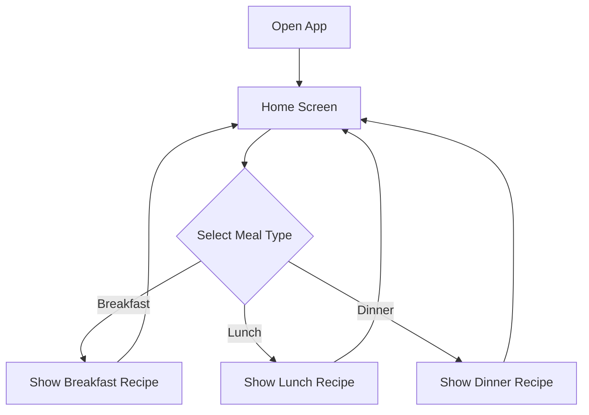

# EasyVegan 🌱

A React Native Expo Go app that suggests easy vegan meals for breakfast, lunch, and dinner every day.

---

## Table of Contents

1. [Overview](#overview)
2. [Features](#features)
3. [Architecture](#architecture)
4. [Project Structure](#project-structure)
5. [Data Management](#data-management)
6. [Code Standards](#code-standards)
7. [Getting Started](#getting-started)
8. [Adding New Recipes](#adding-new-recipes)
9. [Adding New Ingredients](#adding-new-ingredients)
10. [Development Guidelines](#development-guidelines)
11. [Roadmap](#roadmap)
12. [Changelog](#changelog)

---

## Overview

EasyVegan is a simple, no-account-required mobile app that helps users discover delicious vegan meals. Instead of overwhelming users with endless options, the app presents **one breakfast, one lunch, and one dinner suggestion each day**.

### Philosophy

- **Simple**: No browsing, no accounts, just tap and cook
- **Daily Discovery**: Fresh meal suggestions every day
- **Easy to Maintain**: Add recipes by simply adding files to the repository
- **Modular**: Strict code splitting for maintainability

---

## Features

### Core Features

| Feature | Description |
|---------|-------------|
| **Daily Meal Suggestions** | One breakfast, lunch, and dinner recipe per day |
| **No Account Required** | Privacy-first, no sign-up needed |
| **No Browsing** | Curated daily selection, not an overwhelming library |
| **Offline-Ready** | All recipes bundled in the app |

### User Flow



---

## Architecture

### Technology Stack

| Layer | Technology |
|-------|------------|
| **Framework** | React Native with Expo Go |
| **Language** | TypeScript |
| **Navigation** | Expo Router |
| **State** | React Context (minimal) |
| **Styling** | StyleSheet API |

### Design Principles

1. **Code Splitting**: All files must be ≤300 lines of code
2. **Single Responsibility**: Each component does one thing well
3. **Type Safety**: Full TypeScript coverage
4. **Documentation-First**: Update docs with any fundamental changes

---

## Project Structure

```
easyvegan/
├── README.md                    # This documentation
├── app/                         # Expo Router pages
│   ├── _layout.tsx              # Root layout
│   ├── index.tsx                # Home screen
│   └── recipe/
│       └── [mealType].tsx       # Dynamic recipe screen
├── src/
│   ├── components/              # Reusable UI components
│   │   ├── Header.tsx           # App header
│   │   ├── MealButton.tsx       # Meal selection button
│   │   ├── MealCard.tsx         # Recipe card display
│   │   └── RecipeDisplay.tsx    # Full recipe view
│   ├── data/                    # Recipe & ingredient data
│   │   ├── recipes/
│   │   │   ├── breakfast/       # Breakfast recipes
│   │   │   ├── lunch/           # Lunch recipes
│   │   │   └── dinner/          # Dinner recipes
│   │   ├── ingredients/         # Ingredient lists
│   │   └── index.ts             # Data exports
│   ├── types/                   # TypeScript definitions
│   │   └── index.ts             # Type exports
│   ├── utils/                   # Helper functions
│   │   ├── recipeSelector.ts    # Daily recipe selection logic
│   │   └── dateUtils.ts         # Date helper functions
│   └── theme/                   # Styling constants
│       └── index.ts             # Colors, spacing, typography
├── package.json
├── tsconfig.json
└── app.json                     # Expo configuration
```

---

## Data Management

### Recipe Structure

Each recipe is stored as a TypeScript file exporting a `Recipe` object:

```typescript
// src/data/recipes/breakfast/overnight-oats.ts
import { Recipe } from '../../../types';

export const overnightOats: Recipe = {
  id: 'overnight-oats',
  name: 'Overnight Oats',
  mealType: 'breakfast',
  prepTime: 5,        // minutes
  cookTime: 0,        // minutes (overnight setting)
  servings: 1,
  difficulty: 'easy',
  ingredients: [
    { name: 'rolled oats', amount: 0.5, unit: 'cup' }, // Displays as "1/2 cup"
    { name: 'plant milk', amount: 0.5, unit: 'cup' },
    // ... more ingredients
  ],
  instructions: [
    'Combine oats and plant milk in a jar',
    'Add chia seeds and maple syrup',
    // ... more steps
  ],
  tags: ['quick', 'no-cook', 'meal-prep'],
  nutritionPerServing: {
    calories: 350,
    protein: 10,
    carbs: 55,
    fat: 8
  }
};
```

### Ingredient Structure

```typescript
// src/types/index.ts
export interface Ingredient {
  name: string;
  amount: number;
  unit: string;
  optional?: boolean;
}
```

### Daily Selection Algorithm

The app uses a deterministic algorithm based on the current date to select recipes:

```typescript
// Pseudo-code for daily selection
const dayOfYear = getDayOfYear(new Date());
const recipeIndex = dayOfYear % totalRecipes;
```

This ensures:
- Same recipe shown all day for consistency
- Different recipe each day for variety
- Predictable selection for testing

### Formatting

Ingredient amounts are stored as decimals (e.g., `0.5`, `0.25`) for ease of calculation, but are automatically converted to fractions (e.g., `1/2`, `1/4`) when displayed to the user for a better reading experience.

---

## Code Standards

### 300 Line Limit

> [!IMPORTANT]
> **All files must be 300 lines or fewer.** This is a strict requirement.

If a file approaches this limit:
1. Extract reusable logic into utilities
2. Split components into smaller sub-components
3. Move types to dedicated type files
4. Create separate data files

### File Naming

| Type | Convention | Example |
|------|------------|---------|
| Components | PascalCase | `MealButton.tsx` |
| Utilities | camelCase | `recipeSelector.ts` |
| Types | PascalCase | `Recipe.ts` |
| Data | kebab-case | `overnight-oats.ts` |

### Component Template

```typescript
// src/components/ExampleComponent.tsx
import React from 'react';
import { View, Text, StyleSheet } from 'react-native';
import { theme } from '../theme';

interface ExampleComponentProps {
  title: string;
}

export const ExampleComponent: React.FC<ExampleComponentProps> = ({ title }) => {
  return (
    <View style={styles.container}>
      <Text style={styles.title}>{title}</Text>
    </View>
  );
};

const styles = StyleSheet.create({
  container: {
    padding: theme.spacing.md,
  },
  title: {
    fontSize: theme.typography.sizes.lg,
    color: theme.colors.text,
  },
});
```

---

## Getting Started

### Prerequisites

- Node.js 18+
- npm or yarn
- Expo Go app on your mobile device

### Installation

```bash
# Clone the repository
git clone https://github.com/starship/easyvegan.git
cd easyvegan

# Install dependencies
npm install

# Start the development server
npm start
```

### Running on Device

1. Install **Expo Go** from App Store or Play Store
2. Run `npm start` in the project directory
3. Scan the QR code with Expo Go (Android) or Camera (iOS)

---

## Adding New Recipes

### Step 1: Create Recipe File

Create a new file in the appropriate meal folder:

```
src/data/recipes/[breakfast|lunch|dinner]/your-recipe-name.ts
```

### Step 2: Define Recipe

Use the Recipe interface:

```typescript
import { Recipe } from '../../../types';

export const yourRecipe: Recipe = {
  id: 'your-recipe-id',
  name: 'Your Recipe Name',
  mealType: 'lunch',  // or 'breakfast' or 'dinner'
  prepTime: 15,
  cookTime: 20,
  servings: 4,
  difficulty: 'medium',
  ingredients: [
    { name: 'ingredient 1', amount: 1, unit: 'cup' },
    // ... add all ingredients
  ],
  instructions: [
    'Step 1: Do this first',
    'Step 2: Then do this',
    // ... add all steps
  ],
  tags: ['healthy', 'quick'],
  nutritionPerServing: {
    calories: 400,
    protein: 15,
    carbs: 50,
    fat: 12
  }
};
```

### Step 3: Register Recipe

Add export to the meal type's index file:

```typescript
// src/data/recipes/lunch/index.ts
export { yourRecipe } from './your-recipe-name';
```

### Step 4: Update Documentation

If adding a new category or significant feature, update this README.

---

## Adding New Ingredients

Ingredients are defined inline within recipes. For common ingredients that appear in multiple recipes, consider creating a shared ingredients file:

```typescript
// src/data/ingredients/common.ts
export const commonIngredients = {
  plantMilk: { name: 'plant milk', unit: 'cup' },
  tofu: { name: 'firm tofu', unit: 'block' },
  // ... more common ingredients
};
```

---

## Development Guidelines

### Before Starting Work

1. Review this documentation
2. Check the current file line counts
3. Plan component boundaries

### During Development

1. Keep files under 300 lines
2. Write TypeScript types first
3. Test on Expo Go frequently

### After Making Changes

> [!WARNING]
> **Always update documentation** when making fundamental changes to:
> - Project structure
> - Data formats
> - Core algorithms
> - New features

---

## Roadmap

### Phase 1: MVP ✅
- [x] Basic project structure
- [x] Initial recipe for each meal type
- [x] Home screen with meal buttons
- [x] Recipe display screen

### Phase 2: Enhancement (Planned)
- [ ] Recipe images
- [ ] Cooking timer
- [ ] Nutritional information display
- [ ] Dark mode support

### Phase 3: Growth (Future)
- [ ] Seasonal recipe suggestions
- [ ] Shopping list generation
- [ ] Recipe favorites (local storage)

---

## Changelog

### v1.0.0 (Initial Release)
- Initial app structure
- Three starter recipes (breakfast, lunch, dinner)
- Daily meal suggestion system
- Documentation established

---

## Contributing

When contributing:
1. Follow the 300-line file limit strictly
2. Update documentation for any structural changes
3. Test on Expo Go before submitting
4. Add TypeScript types for all new code

---

*Built with 🌱 for easy vegan cooking*
